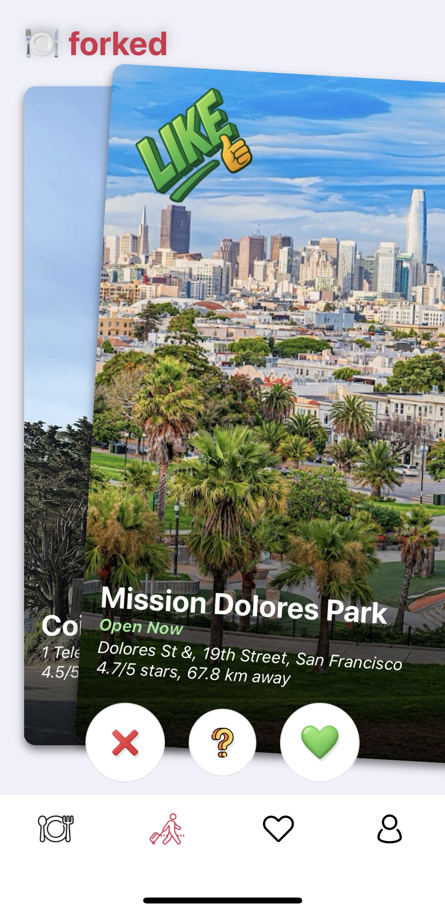
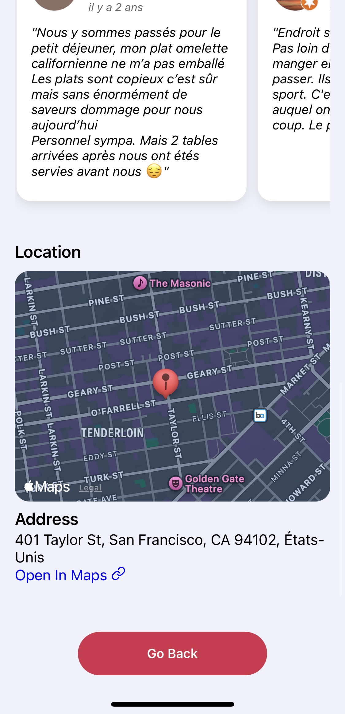

# Forked (mobile application)
A location-based mobile app for discovering nearby restaurants and attractions, designed to make planning outings easier—whether alone or with friends.

## 📱 App Preview

### Swipe on restaurants

  <!-- Row 1: Restaurants -->
  
  
  

### Swipe on attractions

  <!-- Row 2: Attractions -->
  
  
  

### Get specific details about each place

  <!-- Row 3: Place Details -->
  
  
  
  

## 🚀 Progress & Roadmap
- **Core functionalities Completed**
  - Core UI
  - User authentication
  - Google Places API integration

- **Upcoming**
    - Implement live swiping sessions
    - Add onboarding workflow
    - Optimize performance & accessibility

---

## Release Plan
I'm expecting to release a working version to both the **Google Play Store** and **Apple App Store** by the end of this year. Stay tuned for updates.

## 📝 License
This project is licensed under the [Apache License 2.0](LICENSE).
> Note: License terms may change for future versions.
